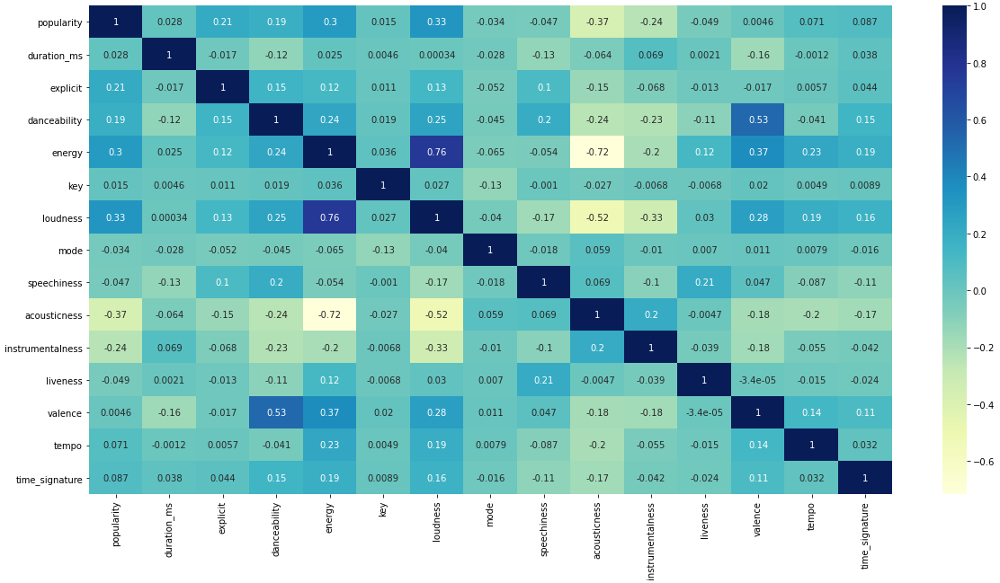
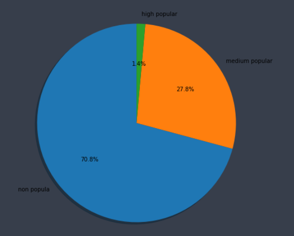
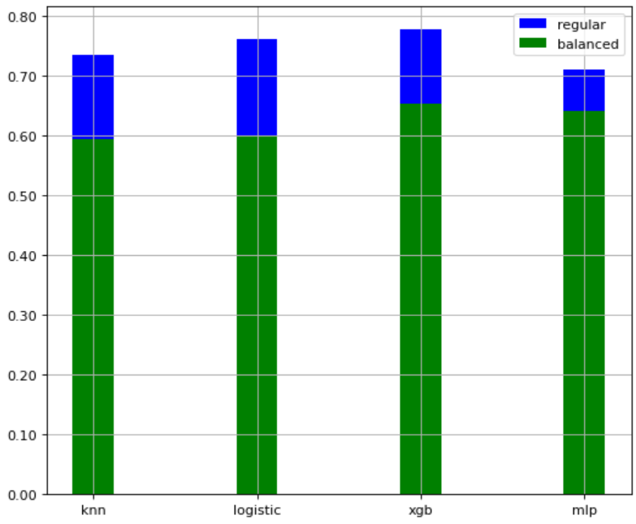

# Final Project Machine Learning Course

By:
[@kggold4](https://www.github.com/kggold4)
[@TalSomech](https://www.github.com/TalSomech)

> Spotify dataset classification

### <i>Dataset [link](https://www.kaggle.com/datasets/yamaerenay/spotify-dataset-19212020-600k-tracks?select=tracks.csv)</i>

## Code

Our main project is in the `spotify_classification.ipynb` notebook, also see the `utils.py` file (for our utils functions).

## Goal

The goal of this project is to train machine learning models (supervised) that will classified the popularity of a spotify song to three classes:

1. high popular
2. medium popular
3. non popular

## Dataset:

Features:

1. acousticness (Ranges from 0 to 1)
2. artists (List of artists mentioned)
3. danceability (Ranges from 0 to 1)
4. duration_ms (Integer typically ranging from 200k to 300k)
5. energy (Ranges from 0 to 1)
6. explicit (0 = No explicit content, 1 = Explicit content) - Categorical.
7. id (Id of track generated by Spotify) - Numerical.
8. id_artists.
9. instrumentalness (Ranges from 0 to 1).
10. key (All keys on octave encoded as values ranging from 0 to 11, starting on C as 0, C# as 1 and so on…).
11. liveness (Ranges from 0 to 1).
12. loudness (Float typically ranging from -60 to 0).
13. mode (0 = Minor, 1 = Major).
14. name (Name of the song).
15. popularity (Ranges from 0 to 100).
16. release_date (Date of release mostly in yyyy-mm-dd format, however precision of date may vary).
17. speechiness (Ranges from 0 to 1).
18. tempo (Float typically ranging from 50 to 150).
19. time_signature.
20. valence (Ranges from 0 to 1).

### Correlations between popularity and others features

### NOTE: during the ordering of the data we applay the popularity for classification to be in the following format:

| class          |  real value  | class value |
| -------------- | :----------: | ----------: |
| high popular   |   70 <= x    |           2 |
| medium popular | 40 <= x < 70 |           1 |
| non popular    |    x < 40    |           0 |

### In order to see the distribution between the number of popularitry classes (unbalanced number of features in data):

## Models result (unbalanced number of features in data):

| model                 | accuracy |
| --------------------- | -------: |
| KNeighbors Classifier |  74.20 % |
| Logistic Regression   |  72.32 % |
| XGB Classifier        |  77.74 % |
| MLP Classifier        |  70.82 % |

## Models result (balanced number of features in data):

| model                 | accuracy |
| --------------------- | -------: |
| KNeighbors Classifier |  59.35 % |
| Logistic Regression   |  60.06 % |
| XGB Classifier        |  65.41 % |
| MLP Classifier        |  64.16 % |

## Models result between regular and balanced data trained (shown in the notebook):

## Conclusions:

It's very difficult to precdict popularity of spotify tracks with the data we have in our data set, Even after we cleaned & normalized our data, and creation balanced and non-balanced training data for our models, We still see that the accuracy of our models is moderate.
